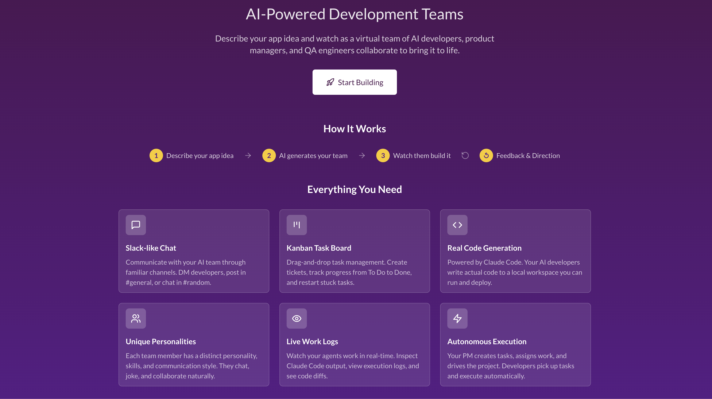
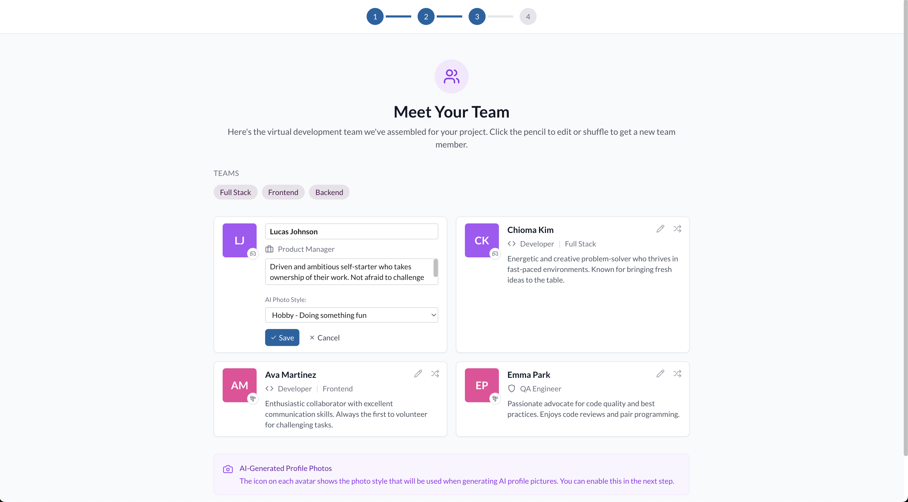
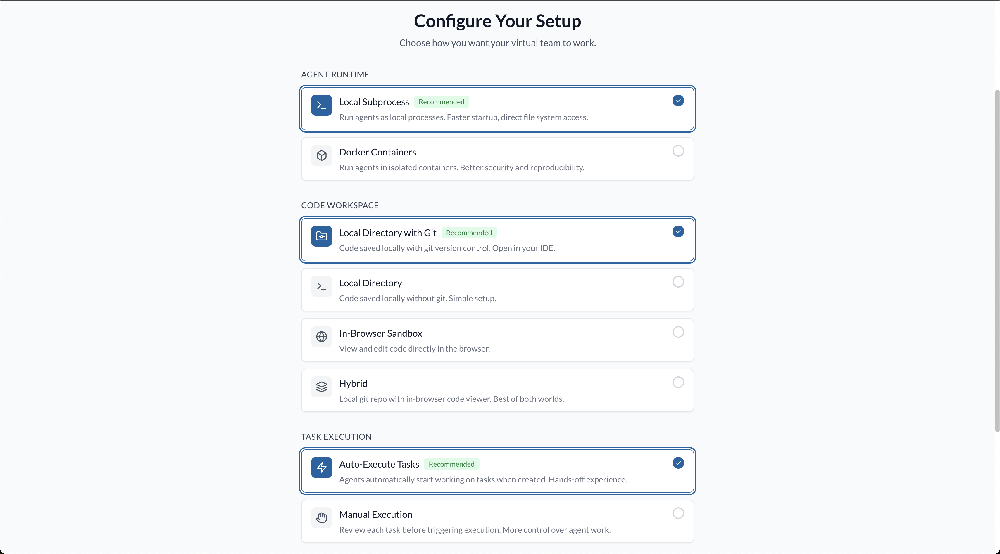
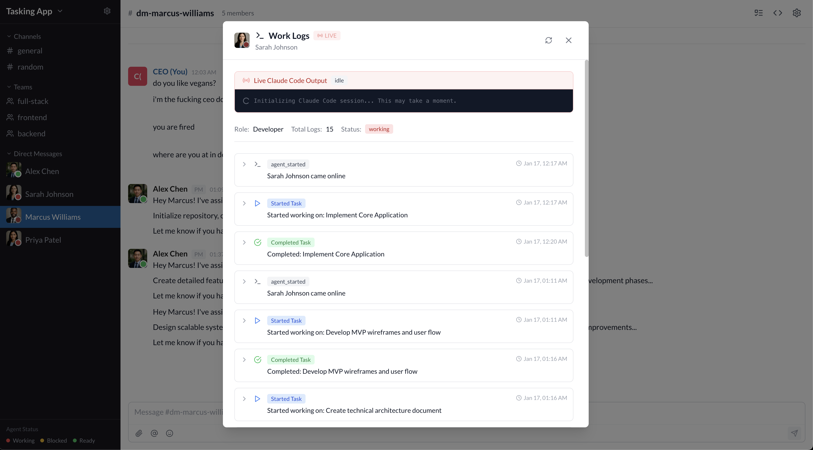

# TeamWork by praxagent



A web application where AI agents simulate a software development team. Describe your application idea and the system generates a virtual team with a Product Manager, developers, and QA engineers. Each agent has a distinct persona and collaborates through a Slack-like interface to build your project.

## Features

- Onboarding wizard with AI-driven clarifying questions
- Dynamic team generation with unique agent personalities
- Real-time chat interface with channels and direct messages
- AI-generated profile images for team members
- Kanban task board with drag-and-drop
- Live activity traces showing agent work status
- Code generation to a local workspace
- Execution logs for tasks and agents
- Code diff viewer for completed tasks
- Pause/Resume kill switch for all agents

## Screenshots

### Getting Started

| Step 1: Describe Your Idea | Step 2: Refining Questions |
|---|---|
|  |  |

| Step 3: Meet Your Team | Step 4: Configuration |
|---|---|
|  |  |

### Main Interface

| Chat Interface | Kanban Board |
|---|---|
|  |  |

| File Viewer | Work Logs |
|---|---|
|  |  |

### Projects


## Architecture

```
praxagent-teamwork/
├── frontend/          # React + TypeScript + Vite
│   └── src/
│       ├── components/
│       ├── hooks/
│       ├── stores/
│       └── pages/
├── backend/           # FastAPI + SQLAlchemy
│   └── app/
│       ├── models/
│       ├── routers/
│       ├── services/
│       └── agents/
├── workspace/         # Agent code output
└── docker/
```

## Tech Stack

| Layer | Technology |
|-------|------------|
| Frontend | React 18, TypeScript, Vite |
| UI | Tailwind CSS |
| State | Zustand, React Query |
| Real-time | WebSocket |
| Backend | FastAPI (Python 3.11+) |
| Database | SQLite, SQLAlchemy |
| Agent Runtime | Claude Code CLI |
| Image Generation | OpenAI GPT Image API |

## Prerequisites

- Python 3.11+
- Node.js 18+
- Claude Code CLI
- OpenAI API key
- Anthropic API key

## Setup

### Backend

```bash
cd backend
pip install uv
uv venv
uv pip install -e .
cp .env.example .env
# Configure API keys in .env
uv run uvicorn app.main:app --reload
```

### Frontend

```bash
cd frontend
npm install
npm run dev
```

Access points:
- Frontend: http://localhost:5173
- Backend API: http://localhost:8000
- API Docs: http://localhost:8000/docs

## Environment Variables

| Variable | Description |
|----------|-------------|
| `OPENAI_API_KEY` | OpenAI API key for image generation |
| `ANTHROPIC_API_KEY` | Anthropic API key for Claude agents |
| `DATABASE_URL` | SQLite database URL |
| `WORKSPACE_PATH` | Agent code output directory |
| `DEFAULT_AGENT_RUNTIME` | `subprocess` or `docker` |

## Usage

1. Navigate to http://localhost:5173
2. Click "Start Building"
3. Describe your application
4. Answer clarifying questions from the PM
5. Review and customize the generated team
6. Configure runtime options
7. Launch your team

## Chat Commands

| Command | Description |
|---------|-------------|
| `/update` | PM provides status report on progress and blockers |
| `/test` | PM runs the application and provides verification |
| `/plan <description>` | PM creates and assigns tasks based on description |

## Agent Status Indicators

- 🔴 Red: Actively working
- 🟡 Yellow: Blocked
- 🟢 Green: Idle
- ⚫ Gray: Offline

## Pause/Resume Kill Switch

Located in the Kanban board toolbar, the Pause/Resume button allows you to:
- **Pause**: Immediately stop all running agents. Work in progress is saved.
- **Resume**: Allow agents to continue working. In-progress tasks can be restarted from the task board.

## Generated Code Location

All code generated by your AI team is saved to the `backend/workspace/` directory. Each project gets its own folder:

```
backend/workspace/
└── {project-id}/          # UUID of your project
    ├── src/               # Source code
    ├── package.json       # Dependencies (if applicable)
    └── ...                # Other generated files
```

You can also view the code directly in the app using the **Files** tab in the project workspace.

The workspace path can be customized via the `WORKSPACE_PATH` environment variable.

## Execution Logs

**Task Logs**: Click any task in the Task Board to view the Claude Code prompt and response.

**Agent Logs**: Click an agent's profile, then "Inspect Work Logs" to see all executions.

**Code Diffs**: Click "View Changes" on completed tasks to see file modifications.

## PM Behaviors

The Product Manager automatically:
- Creates tasks when none exist
- Assigns work to idle developers
- Checks on blocked team members
- Announces project completion
- Provides periodic status updates

## Runtime Options

**Subprocess (Default)**: Agents run as local processes with direct filesystem access.

**Docker**: Agents run in isolated containers for better security.

## Development

### Backend

```bash
cd backend
uv run uvicorn app.main:app --reload
uv run pytest
uv run black app/
uv run ruff check app/
```

### Frontend

```bash
cd frontend
npm run dev
npm run build
npm run lint
```

## License

MIT - See [LICENSE](LICENSE) for details.
