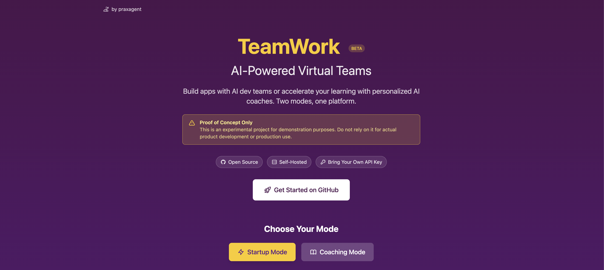

# TeamWork



> **PROOF OF CONCEPT**
>
> **This is an experimental project for demonstration and learning purposes only.** It is not intended for actual product development or production use. The AI agents may produce incomplete, incorrect, or non-functional code. Do not rely on this tool for building real software products. Use at your own risk and for educational/exploratory purposes only.

An open-source research project exploring human-friendly ways to interact with multiple AI agents. Not to replace teams, but to magnify human talent by empowering individuals with their own dedicated teams through a familiar, human-like interface.

Two modes: **Startup Mode** for building software with AI dev teams, and **Coaching Mode** for personalized learning with AI tutors. Each creates a virtual team of AI agents that collaborate through a Slack-like interface.

> **Important: API Keys & Costs**
>
> This application requires your own API keys:
> - **Anthropic API Key** (required) - Powers the AI agents via Claude
> - **OpenAI API Key** (optional) - For AI-generated profile images
>
> **Use at your own risk.** Running AI agents can consume significant API credits, especially for complex projects or extended sessions. Monitor your API usage dashboards and set spending limits. The authors are not responsible for any charges incurred.

## Two Modes

### Startup Mode
Build software with a virtual dev team:
- **Product Manager** - Breaks down requirements, creates tasks, coordinates team
- **Developers** - Write code using Claude Code in isolated Docker containers
- **QA Engineers** - Test and verify functionality

### Coaching Mode
Accelerate your learning with personalized AI coaches:
- **Topic Coaches** - One expert coach per goal (languages, math, interview prep, fitness, professional skills, etc.)
- **Personal Manager** - Coordinates all coaches, tracks progress, keeps you motivated
- **Progress Tracking** - Vocabulary lists, skill ratings, topic coverage, conversation history

## Features

### Common Features (Both Modes)
- **Just Launch!** - Go from idea to working team in seconds with AI-automated setup
- Onboarding wizard with AI-driven clarifying questions (or skip with Just Launch)
- Dynamic team generation with unique agent personalities
- Real-time chat interface with channels and direct messages
- AI-generated profile images for team members
- Kanban task board with drag-and-drop
- Customizable agent personalities (edit soul.md and skills.md prompts)

### Startup Mode Features
- **Live Sessions** - Watch agents work in real-time with rich formatted output
- **Takeover & Release** - Jump into any agent's terminal, work directly, then hand control back
- Code generation to a local workspace (mounted in Docker for security)
- Code diff viewer for completed tasks
- Pause/Resume kill switch for all agents
- **Smart terminal detection** - LLM-powered idle detection prevents agents from getting stuck
- **Executive Access** - Run Claude Code or terminal sessions directly in the browser

### Coaching Mode Features
- **Progress Panel** - Track learning journey with coach cards and skill metrics
- **Long-term Memory** - Coaches remember your strengths, weaknesses, and learning style
- **Topic Coverage** - See what you've learned and what's next
- **Markdown Notes** - All progress stored in editable markdown files

## Screenshots

### Startup Mode

| Step 1: Describe Your Idea | Step 2: Refining Questions |
|---|---|
|  |  |

| Step 3: Meet Your Team | Step 4: Configuration |
|---|---|
|  |  |

| Chat Interface | Kanban Board |
|---|---|
|  |  |

| File Viewer | Live Sessions |
|---|---|
|  |  |

#### Executive Access


Launch Claude Code or terminal sessions directly in your browser. Agents run in isolated Docker containers for security, with your workspace mounted so you can edit code in your IDE while they work.

### Coaching Mode

| Personalized Coaching | Meet Your Coaches |
|---|---|
|  |  |

| Progress Tracking |
|---|
|  |

Each coach adapts to your level and learning style. Get explanations, practice problems, and instant feedback. Coaches track your progress in markdown files that you can view and edit.

### Projects


## Quick Start with Docker

The easiest way to run TeamWork is with Docker Compose.

### Prerequisites

- Docker and Docker Compose (required for agent execution)
- Anthropic API key
- OpenAI API key (optional, for profile image generation)

### Steps

1. **Clone and configure:**
   ```bash
   git clone https://github.com/praxagent/teamwork.git
   cd teamwork
   cp .env.example .env
   # Edit .env and add your API keys
   ```

2. **Start the application:**
   ```bash
   docker-compose up -d
   ```

3. **Access the app:**
   - Frontend: http://localhost:3000
   - Backend API: http://localhost:8000
   - API Docs: http://localhost:8000/docs

4. **Stop the application:**
   ```bash
   docker-compose down
   ```

### Docker Volumes

| Path | Description |
|------|-------------|
| `./workspace/` | Generated code (Startup) or coaching notes (Coaching) |
| `./data/` | SQLite database |
| `./.env` | Environment variables (API keys) |

Your generated code and coaching progress persists in the `workspace/` folder even after stopping containers.

---

## Local Development Setup

For development or if you prefer not to use Docker.

### Prerequisites

- Python 3.11+
- Node.js 18+
- Docker (for agent execution in isolated containers)
- Anthropic API key
- OpenAI API key (optional, for AI profile images)

**Note**: Agents run in Docker containers for security, even during local development. Build the agent image first:
```bash
docker build -t vteam/agent:latest -f docker/agent.Dockerfile .
```

### Quick Start (Recommended)

Use the dev script to run both backend and frontend with one command:

```bash
# Configure environment
cp .env.example .env
# Edit .env and add your API keys

# Run everything
./dev.sh
```

The script will:
- Check prerequisites and install dependencies
- Create data directories
- Start both backend and frontend servers
- Handle Ctrl+C gracefully to stop both

### Manual Setup

If you prefer to run servers separately:

#### Backend

```bash
cd backend

# Install uv package manager (if not installed)
pip install uv

# Create virtual environment and install dependencies
uv venv
source .venv/bin/activate  # On Windows: .venv\Scripts\activate
uv pip install -e .

# Run the server
uvicorn app.main:app --reload
```

#### Frontend

```bash
cd frontend
npm install
npm run dev
```

### Access Points (Local)

- Frontend: http://localhost:5173
- Backend API: http://localhost:8000
- API Docs: http://localhost:8000/docs

### Data Locations (Same for Docker and Local)

Both Docker and local development use the same directory structure at the **project root**:

```
teamwork/
├── .env              # API keys (not committed)
├── data/             # SQLite database
│   └── vteam.db
├── workspace/        # Generated code / coaching notes
│   └── {project-dirs}/
│       ├── .agents/         # Agent personality prompts
│       │   └── {agent-name}/
│       │       ├── soul.md
│       │       └── skills.md
│       └── .coaching/       # Coaching mode progress (if applicable)
│           └── {coach-name}/
│               ├── progress.md
│               ├── vocabulary.md
│               └── ...
├── backend/
└── frontend/
```

The backend auto-detects whether you're running from `backend/` or the project root and uses the correct paths.

---

## Architecture

```
teamwork/
├── frontend/              # React + TypeScript + Vite
│   ├── src/
│   │   ├── components/
│   │   ├── hooks/
│   │   ├── stores/
│   │   └── pages/
│   ├── Dockerfile
│   └── nginx.conf
├── backend/               # FastAPI + SQLAlchemy
│   ├── app/
│   │   ├── models/
│   │   ├── routers/
│   │   ├── services/
│   │   └── agents/
│   │       └── prompts/   # Centralized prompt templates
│   └── Dockerfile
├── workspace/             # Generated code (git-ignored)
├── data/                  # SQLite database (git-ignored)
├── docker-compose.yml
└── .env                   # API keys (git-ignored)
```

## Tech Stack

| Layer | Technology |
|-------|------------|
| Frontend | React 18, TypeScript, Vite |
| UI | Tailwind CSS |
| State | Zustand, React Query |
| Real-time | WebSocket |
| Backend | FastAPI (Python 3.11+) |
| Database | SQLite, SQLAlchemy |
| Agent Runtime | Claude Code CLI |
| Image Generation | OpenAI GPT Image API |
| Containerization | Docker, Docker Compose |

## Environment Variables

Create a `.env` file in the **project root** (copy from `.env.example`):

### Required

| Variable | Description |
|----------|-------------|
| `ANTHROPIC_API_KEY` | Anthropic API key for Claude agents |

### Optional - General

| Variable | Default | Description |
|----------|---------|-------------|
| `OPENAI_API_KEY` | - | OpenAI API key for AI-generated profile images* |
| `DATABASE_URL` | `sqlite:///./vteam.db` | Database URL |
| `WORKSPACE_PATH` | `./workspace` | Code output directory |
| `CLAUDE_CONFIG_BASE64` | - | Base64-encoded `~/.claude.json` for Docker auth (see below) |

*If `OPENAI_API_KEY` is not provided, AI profile image generation is automatically disabled. Agents will use colored initials avatars instead.

### Model Configuration

Override which Claude models are used for different tasks:

| Variable | Default | Description |
|----------|---------|-------------|
| `MODEL_ONBOARDING` | `claude-haiku-4-5` | Project analysis and team generation |
| `MODEL_PM` | `claude-sonnet-4-5` | PM interactions and task management |
| `MODEL_AGENT_SIMPLE` | `claude-haiku-4-5` | Simple tasks and idle detection |
| `MODEL_AGENT_MODERATE` | `claude-sonnet-4-5` | Moderate complexity tasks |
| `MODEL_AGENT_COMPLEX` | `claude-opus-4-5` | Complex architecture tasks |

Using dateless versions (e.g., `claude-sonnet-4-5`) automatically points to the latest model.

### PM Monitoring Configuration

| Variable | Default | Description |
|----------|---------|-------------|
| `PM_CHECK_INTERVAL_SECONDS` | `300` | How often PM checks progress (5 min) |
| `PM_IDLE_THRESHOLD_MINUTES` | `30` | When to consider a developer idle |
| `PM_AUTO_NUDGE` | `true` | Auto-nudge idle developers |

### Task Retry Configuration

| Variable | Default | Description |
|----------|---------|-------------|
| `MAX_TASK_RETRIES` | `3` | Max retries before moving task to TODO |
| `TASK_RETRY_DELAY_SECONDS` | `5` | Delay between retry attempts |

## Usage

1. Navigate to http://localhost:3000 (Docker) or http://localhost:5173 (local)
2. Click "Start Building"
3. **Choose your mode:**
   - **Startup** - Build software with an AI dev team
   - **Coaching** - Learn with personalized AI coaches
4. Describe your app idea (Startup) or learning goals (Coaching)
5. Choose your onboarding path:
   - **Just Launch!** - AI answers all questions and uses optimal defaults (fastest)
   - **Customize** - Answer refining questions, customize team and config
6. Start working with your team!

The "Just Launch!" option lets you go from idea to working team in seconds by having AI handle all the setup decisions automatically.

## Chat Commands (Startup Mode)

| Command | Description |
|---------|-------------|
| `/update` | PM provides status report on progress and blockers |
| `/test` | PM runs the application and provides verification |
| `/plan <description>` | PM creates and assigns tasks based on description |

## Agent Status Indicators

- 🔴 **Red**: Actively working on a task
- 🟡 **Yellow**: Blocked, needs input
- 🟢 **Green**: Idle, ready for work
- ⚫ **Gray**: Offline

## Profile Images

**AI-Generated Images** (requires OpenAI API key):
- During onboarding, TeamWork can generate unique profile photos using OpenAI's image API
- Images are based on each agent's persona (professional, vacation, hobby, pet, etc.)

**Manual Upload**:
- Click any agent's profile picture to open their profile
- Hover over the avatar to see upload/remove buttons
- Upload any image (max 2MB) to replace the current avatar
- Works whether or not AI generation is enabled

**No OpenAI Key?**
- If `OPENAI_API_KEY` is not set, AI image generation is automatically disabled
- Agents use colored initials avatars by default
- You can still upload custom images at any time

## Customizing Agent Personalities

Each agent's personality is defined by two prompts stored in the workspace:

```
workspace/{project-id}/.agents/{agent-name}/
├── soul.md      # Core personality, values, communication style
└── skills.md    # Technical abilities, domain expertise
```

**Edit these files to customize how agents behave:**
- Change their tone, formality, or teaching style
- Add domain-specific knowledge
- Adjust their approach to problem-solving

Changes take effect on the agent's next message. You can edit via:
- The **File Browser** in the app
- The **Profile Modal** (click agent → Edit Personality)
- Your favorite text editor (files are in `./workspace/`)

## Pause/Resume Kill Switch (Startup Mode)

Located in the Kanban board toolbar:
- **Pause**: Immediately stop all running agents. Work in progress is saved.
- **Resume**: Allow agents to continue. Restart tasks from the task board.

## Executive Access (Startup Mode)

Access Claude Code or a terminal directly from the main navigation. Click the **Sparkles** icon (✨) in the header to open Executive Access, or use the **Claude Code** button in the Files view.

### Secure Docker Environment

All agents run in isolated Docker containers for security:
- **Sandboxed execution** - Agents cannot access files outside the workspace
- **Shared workspace** - Your `./workspace/` folder is mounted so you can edit code in your IDE
- **No permission prompts** - `--dangerously-skip-permissions` is enabled since the container is isolated
- Uses your `ANTHROPIC_API_KEY` for Claude API access

### Smart Terminal Detection

Agents automatically detect when Claude Code is:
- **Waiting for input** - Auto-responds to permission prompts and menus
- **Task completed** - Detects completion patterns and exits cleanly
- **Stuck** - Uses LLM fallback (Haiku) after 30s idle to analyze and respond

This prevents agents from getting stuck on interactive prompts while keeping API costs minimal.

### Authentication Setup (Required for Startup Mode)

Agents need your Claude authentication. Export your Claude config as base64:

```bash
# First, authenticate Claude Code locally (one time):
claude

# Then export your config:
cat ~/.claude.json | base64

# Add to your .env file:
CLAUDE_CONFIG_BASE64=<paste the base64 string here>
```

The base64 config is decoded and mounted into each Docker container at `~/.claude.json`.

**Note**: The auth file is `~/.claude.json` (in home directory), NOT `~/.claude/claude.json`.

### Building the Agent Image

Before using Docker mode, build the agent image:

```bash
docker build -t vteam/agent:latest -f docker/agent.Dockerfile .
```

If the image isn't available, agents will fall back to local execution with a warning.

## Progress Tracking (Coaching Mode)

Coaches automatically track your learning progress in markdown files:

```
workspace/{project-id}/.coaching/{coach-name}/
├── progress.md      # Current level, goals, session count
├── learnings.md     # What you know about me, strengths, areas to improve
├── vocabulary.md    # New words/terms with definitions (language learning)
├── topics-covered.md # Topics reviewed with timestamps
├── ratings.md       # Skill assessments over time
└── summary.md       # Conversation summaries for long-term memory
```

View progress via:
- **Progress Panel** - Click the chart icon in the navbar
- **File Browser** - Browse the `.coaching/` folder directly
- **Your text editor** - Files are in `./workspace/`

## Model Selection

Control which Claude models your agents use via environment variables:

| Task Type | Default Model | Env Variable |
|-----------|---------------|--------------|
| Onboarding/Analysis | Haiku 4.5 | `MODEL_ONBOARDING` |
| PM Interactions | Sonnet 4.5 | `MODEL_PM` |
| Simple Tasks | Haiku 4.5 | `MODEL_AGENT_SIMPLE` |
| Moderate Tasks | Sonnet 4.5 | `MODEL_AGENT_MODERATE` |
| Complex Tasks | Opus 4.5 | `MODEL_AGENT_COMPLEX` |

The PM automatically assigns task complexity based on the work involved:
- **Simple**: Typos, docs, minor fixes → Haiku (fast, cheap)
- **Moderate**: Features, bug fixes → Sonnet (balanced)
- **Complex**: Architecture, security, databases → Opus (most capable)

Using dateless model names (e.g., `claude-sonnet-4-5`) automatically uses the latest version.

## Generated Code Location

All code generated by your AI team is saved to the `workspace/` directory:

```
workspace/
└── {project-id}/          # UUID of your project
    ├── .agents/           # Agent personality prompts
    ├── .coaching/         # Coaching progress (coaching mode)
    ├── src/               # Source code (startup mode)
    ├── package.json       # Dependencies (if applicable)
    └── ...                # Other generated files
```

View code in-app using the **Files** tab, or browse the folder directly.

## Live Sessions & Takeover (Startup Mode)

### Watching Agents Work

The **Live Sessions** panel shows real-time agent activity with a rich, formatted view:

- **Task Header** - See which task the agent is working on
- **Progress Tracking** - Visual todo checklist with completion status
- **Tool Calls** - Collapsible cards showing commands, file reads/writes, and their outputs
- **Claude's Notes** - Text messages from the agent about their progress
- **Result Summary** - Cost and duration when the task completes

Toggle between **Rich View** (formatted) and **Raw View** (terminal output) at any time.

### Taking Over an Agent

Need to help or take manual control? Click **Take Over** to:

1. Pause the agent's current work
2. Open an interactive terminal in their Docker container
3. Run any commands - `git`, `npm`, `claude`, etc.
4. Click **Release to Agent** when done - they'll resume picking up tasks

This lets you collaborate with agents: fix a tricky bug, install a dependency, or run Claude Code yourself, then hand control back seamlessly.

### Execution Logs

- **Task Logs**: Click any task in the Task Board to view Claude Code prompt and response
- **Agent Logs**: Click an agent's profile → "Inspect Work Logs" to see all executions
- **Code Diffs**: Click "View Changes" on completed tasks to see file modifications

## PM Behaviors (Startup Mode)

The Product Manager automatically:
- Creates tasks when none exist
- Assigns work to idle developers
- Checks on blocked team members
- Announces project completion
- Provides periodic status updates

## Personal Manager Behaviors (Coaching Mode)

The Personal Manager automatically:
- Coordinates between all coaches
- Tracks your overall progress
- Creates learning tasks on the Kanban board
- Provides motivation and accountability
- Helps you stay on track with your goals

## Development

### Backend

```bash
cd backend
uv run uvicorn app.main:app --reload
uv run pytest
uv run black app/
uv run ruff check app/
```

### Frontend

```bash
cd frontend
npm run dev
npm run build
npm run lint
```

### Docker Build

```bash
# Build images
docker-compose build

# Run with logs visible
docker-compose up

# Run in background
docker-compose up -d

# View logs
docker-compose logs -f

# Rebuild after code changes
docker-compose up --build
```

## Data Persistence & Backup

### What Gets Stored

| Data | Location | Contains |
|------|----------|----------|
| Database | `data/vteam.db` | Projects, agents, tasks, messages, activity logs |
| Generated Code | `workspace/{project-id}/` | Code (startup) or coaching notes (coaching) |

### Docker Volume Mounts

Both directories are mounted outside the container to persist data:

```yaml
volumes:
  - ./workspace:/workspace    # Agent-generated code / coaching notes
  - ./data:/app/data          # SQLite database
```

**Important**: Your data lives on the host machine, not inside Docker. Stopping or removing containers won't delete your projects.

### Backing Up Your Data

**Quick backup** (database only):
```bash
cp data/vteam.db data/vteam.db.backup
```

**Full backup** (database + all generated code):
```bash
# Create timestamped backup
BACKUP_DIR="backups/$(date +%Y%m%d_%H%M%S)"
mkdir -p "$BACKUP_DIR"
cp -r data/ "$BACKUP_DIR/"
cp -r workspace/ "$BACKUP_DIR/"
echo "Backup created at $BACKUP_DIR"
```

**Automated daily backup** (add to crontab):
```bash
# Run 'crontab -e' and add:
0 2 * * * cd /path/to/teamwork && cp data/vteam.db "backups/vteam_$(date +\%Y\%m\%d).db"
```

### Restoring from Backup

```bash
# Stop the application first
docker-compose down  # or stop the backend

# Restore database
cp backups/vteam.db.backup data/vteam.db

# Restore workspace (if backed up)
cp -r backups/workspace/* workspace/

# Restart
docker-compose up -d  # or start the backend
```

### SQLite Notes

- SQLite uses WAL (Write-Ahead Logging) mode for better concurrency
- You may see `vteam.db-wal` and `vteam.db-shm` files - these are normal
- For a clean backup, either stop the server or copy all three files together

## Troubleshooting

### "Claude Code CLI not available"
Install the Claude Code CLI:
```bash
npm install -g @anthropic-ai/claude-code
```

### Agents stuck in "working" state
This can happen after a server restart. Open the agent's Work Logs - stale states are automatically detected and reset.

### Database issues
Reset the database (warning: deletes all data):
```bash
rm -rf data/vteam.db*
```

### Cleanup Commands

The project includes several cleanup utilities via Makefile:

```bash
# Clean up Python caches and node_modules
make clean

# Stop and remove all vteam Docker containers
make clean-docker

# Clean everything (files + Docker containers)
make clean-all

# Delete just the database (keeps generated code)
make reset-db

# Full reset: database, workspace, and Docker containers
make reset-all
```

| Command | Files/Caches | Docker Containers | Database | Workspace |
|---------|:------------:|:-----------------:|:--------:|:---------:|
| `make clean` | ✅ | ❌ | ❌ | ❌ |
| `make clean-docker` | ❌ | ✅ | ❌ | ❌ |
| `make clean-all` | ✅ | ✅ | ❌ | ❌ |
| `make reset-db` | ❌ | ❌ | ✅ | ❌ |
| `make reset-all` | ❌ | ✅ | ✅ | ✅ |

**Note**: When you stop the backend with `Ctrl+C`, it automatically cleans up Docker containers and temp files. The Makefile commands are for manual cleanup when needed.

### Project Reset vs Delete

You can reset or delete individual projects from the Settings panel in the UI. Here's what each operation does:

| Resource | Reset | Delete |
|----------|:-----:|:------:|
| Project record | ✅ Kept | ❌ Deleted |
| Team members (agents) | ✅ Kept (status → idle) | ❌ Deleted |
| Task definitions | ✅ Kept (status → pending) | ❌ Deleted |
| Channels | ✅ Kept | ❌ Deleted |
| Chat messages | ❌ Cleared | ❌ Deleted |
| Activity logs | ❌ Cleared | ❌ Deleted |
| Docker containers | ❌ Stopped & removed | ❌ Stopped & removed |
| Workspace files | ❌ Cleared (keeps .git) | ❌ Deleted entirely |

**Reset** = Start the project over with the same team and tasks (like a "new game+")
**Delete** = Remove everything and start from scratch

### Start completely fresh

To wipe everything and start over:

```bash
# Stop the server first (Ctrl+C), then:
make reset-all
```

This removes:
- All projects, agents, tasks, and chat history (database)
- All generated code (workspace folder)
- All vteam Docker containers

The folders will be recreated automatically when you restart the server.

### Docker container won't start
Check logs:
```bash
docker-compose logs backend
docker-compose logs frontend
```

### Stray processes after stopping dev.sh

If you see "Port 5173 is in use" or old data persists after deleting the database, there may be leftover processes from a previous run. The `dev.sh` script normally cleans these up automatically, but if they escape:

```bash
# Stop any leftover backend processes
pkill -f "uvicorn app.main:app"

# Stop any leftover frontend processes
lsof -ti:5173 | xargs kill -9 2>/dev/null
lsof -ti:8000 | xargs kill -9 2>/dev/null

# Stop any leftover Claude Code CLI processes (spawned by agents)
# WARNING: This will also kill any Claude Code sessions you're running manually!
# Only run this if you're sure you don't have other Claude sessions running.
pkill -f "claude -p"

# Now you can safely delete data and restart
rm -rf data workspace
./dev.sh
```

**Why this happens**: SQLite keeps database files open via file handles. If you delete the `data/` folder while the backend is still running, the process keeps the data in memory via the open file handle. The data only truly disappears when the process exits.

## References

- [Claude Code Programmatic Usage](https://code.claude.com/docs/en/headless) - Documentation for running Claude Code via CLI
- [Anthropic API](https://docs.anthropic.com/) - Claude API documentation
- [OpenAI Image Generation](https://platform.openai.com/docs/guides/images) - For AI-generated profile images

## License

GNU AFFERO GENERAL PUBLIC LICENSE - See [LICENSE](LICENSE) for details.
