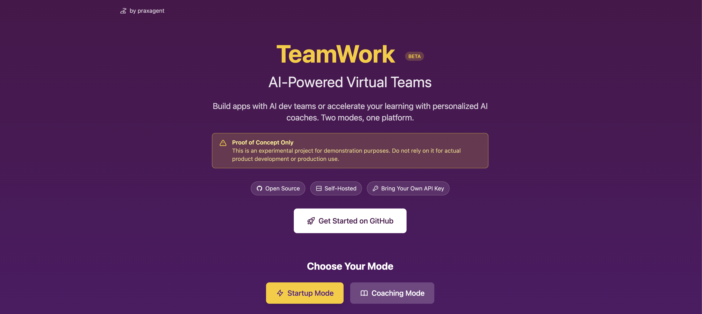
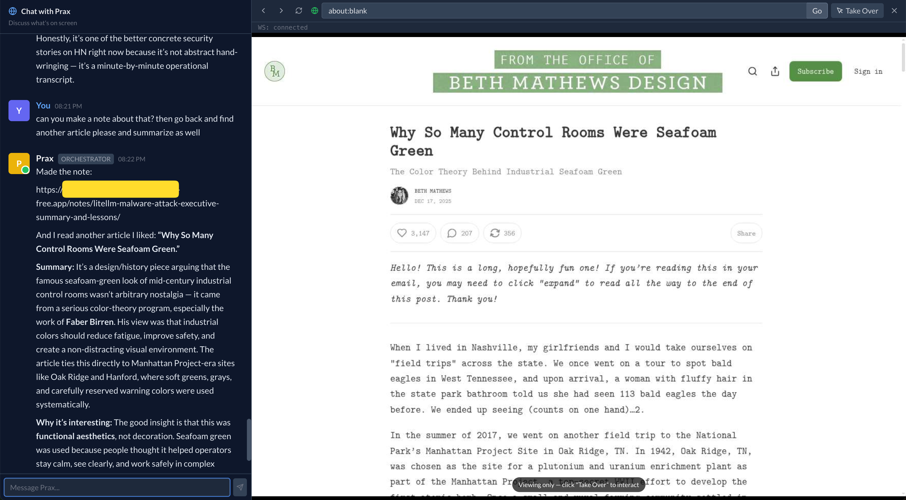
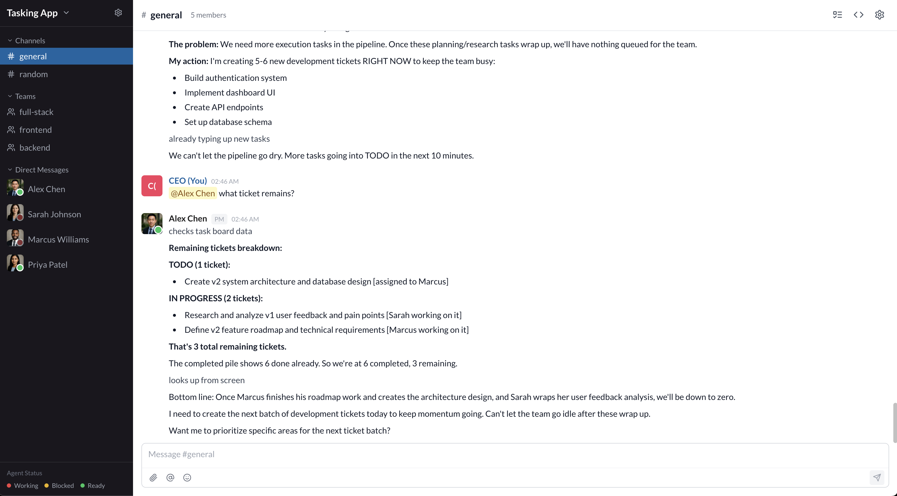
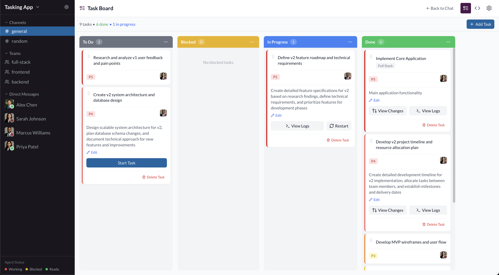
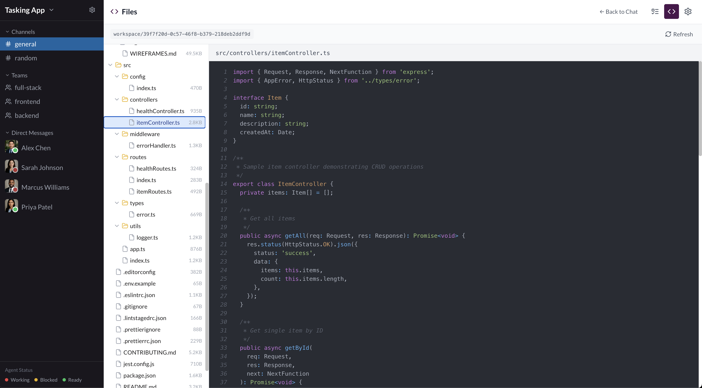
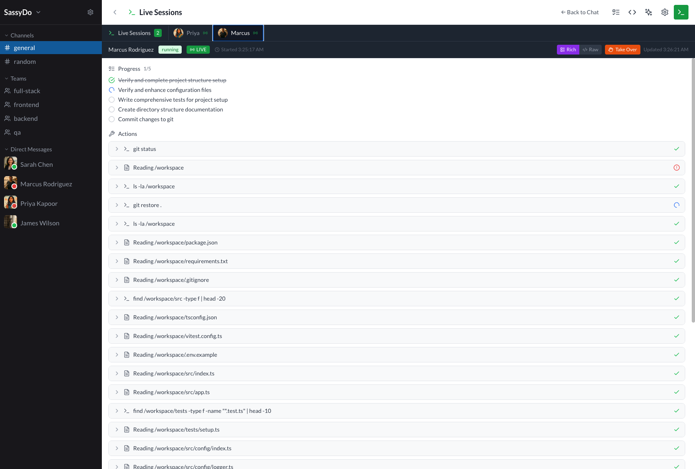
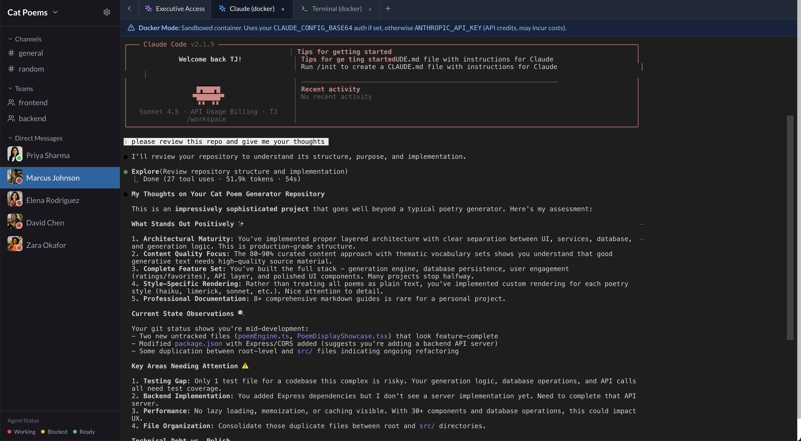
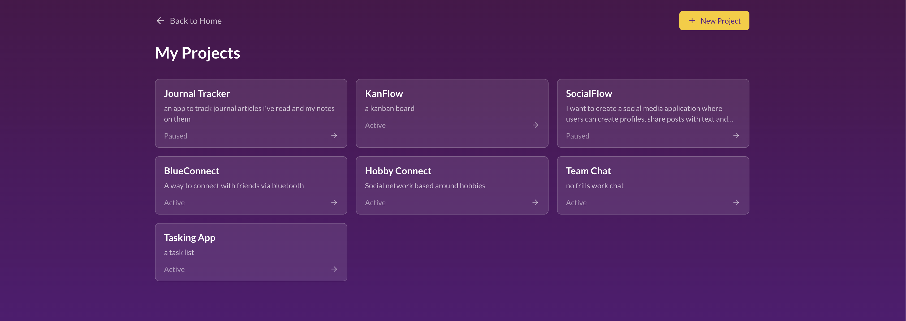

# TeamWork



> **Breaking change (v0.2.0):** TeamWork is now a pure display shell — all built-in AI agent logic (PM orchestration, coaching, persona generation, response generation) has been removed. TeamWork no longer calls any LLM APIs directly. Instead, an external agent (like [Prax](https://github.com/praxagent/gpt-transcriber)) provides the intelligence via TeamWork's REST API. If you were using the previous self-contained version with built-in agents, it is preserved at [v0.1.0](https://github.com/praxagent/teamwork/releases/tag/v0.1.0).

An open-source, **agent-agnostic collaboration shell** — a Slack-like web UI for AI agent teams. TeamWork provides the body (chat, channels, task board, file browser, **embedded terminal**, **live browser screencast**) while you bring the brains (your own agent framework).

Think of TeamWork as a dumb terminal: it displays messages, tracks tasks, and renders files — but it doesn't decide what to say or do. Your agent talks to TeamWork through a simple REST + WebSocket API, just like a human would use Slack.



*Chat with your agent on the left while watching it browse the web in real time on the right. The embedded browser streams a live screencast from a headless Chrome instance running in the agent's sandbox — you see exactly what the agent sees, and can take over with mouse and keyboard at any time.*

> **API Keys & Costs** — TeamWork itself requires no AI API keys. However, the external agent you connect (e.g. Prax) will consume API credits. Monitor your usage dashboards and set spending limits.

## Table of Contents

- [Features](#features)
- [Embedded Terminal & Browser](#embedded-terminal--browser)
- [Quick Start](#quick-start)
- [Installation](#installation)
- [Connecting Your Agent](#connecting-your-agent)
- [Integration Guide](#integration-guide)
- [Prax — First-Class Agent](#prax--first-class-agent)
- [Architecture](#architecture)
- [Workspace Structure](#workspace-structure)
- [Workspace Backup](#workspace-backup)
- [Database Management](#database-management)
- [Full-Text Search (FTS5 + BM25)](#full-text-search-fts5--bm25)
- [SQLite in Production](#sqlite-in-production--scaling-characteristics)
- [Screenshots](#screenshots)
- [Environment Variables](#environment-variables)
- [Development](#development)
- [API Reference](#api-reference)
- [License](#license)

## Features

- **Real-time chat** — Channels and direct messages with WebSocket updates
- **Channel mirroring** — Dedicated #discord and #sms channels that mirror cross-channel conversations, so you can follow everything from one place
- **Kanban task board** — Drag-and-drop task management with status tracking
- **File browser** — View and edit workspace files in-browser
- **Embedded terminal** — Full PTY shell into the agent's sandbox container, right in the browser. Watch your agent run commands, or take over and type yourself. Powered by xterm.js with Docker exec under the hood
- **Live browser screencast** — Stream a real-time view of the headless Chrome running in the sandbox. See exactly what your agent sees as it browses, scrapes, or interacts with web apps. Click "Take Over" to control the browser with your own mouse and keyboard — then hand it back
- **Execution graph visualization** — Real-time tree view of agent delegation chains. See which spokes are running, tool call counts, timing, and status. Click any node to inspect live output
- **Live agent output** — Terminal-style real-time execution stream for each agent. Select any agent to watch its work; working agents highlighted and sorted to top. Full-width layout for maximum visibility
- **Agent roster** — Display agent names, roles, avatars, and online status
- **External Agent API** — REST endpoints for any agent to send messages, update tasks, manage files, push live output, and ensure channels
- **Installable** — `uv pip install` from GitHub; bundles the React frontend as static files
- **Single container** — One Docker image serves both API and frontend (no nginx needed)
- **Zero AI dependencies** — No LLM API keys, no anthropic/openai packages

## Embedded Terminal & Browser

Most agent UIs are chat-only — you talk to the agent but you can't *see* what it's doing. TeamWork fixes that.

### Live Browser Screencast

Your agent runs a headless Chrome inside its sandbox container. TeamWork proxies the Chrome DevTools Protocol (CDP) and streams screenshots to the frontend over WebSocket. You get a real-time, low-latency view of whatever the agent is looking at — web pages, documentation, dashboards, anything.

Click **"Take Over"** in the top-right corner to seize control: your mouse clicks and keystrokes are relayed directly to the headless browser. When you're done, hand it back to the agent. This makes debugging, guiding, and collaborating with your agent seamless — you're not guessing what it did, you're watching it happen.

**How it works:** The sandbox container runs Chromium with `--headless=new` and exposes CDP on port 9222. A `socat` bridge forwards it to `0.0.0.0:9223` so TeamWork can reach it across the Docker network. TeamWork's `/api/browser/ws/{project_id}` endpoint captures screenshots via CDP and relays input events back.

### In-Browser Terminal

TeamWork embeds a full terminal (xterm.js) that connects to a PTY inside the agent's sandbox container via `docker exec`. It's the same shell your agent uses — you see its files, its installed packages, its running processes.

Use it to:
- **Watch the agent work** — see commands execute in real time
- **Debug issues** — inspect files, check logs, run tests
- **Take over** — type commands yourself when the agent gets stuck
- **Install tools** — add packages or dependencies the agent needs

The terminal is not a toy — it's a full interactive shell with color support, tab completion, and scroll history. Multiple sessions can run simultaneously.

**How it works:** TeamWork creates a WebSocket-backed PTY session via `docker exec -it <container> /bin/bash`. The frontend renders it with xterm.js + the fit addon for responsive sizing.

## Quick Start

### Option 1: Docker Compose (recommended)

```bash
git clone https://github.com/praxagent/teamwork.git
cd teamwork
cp .env.example .env
docker compose up -d
# UI: http://localhost:3000 — API: http://localhost:8000
```

### Option 2: From source

```bash
git clone https://github.com/praxagent/teamwork.git
cd teamwork
make install           # uv pip install -e ".[dev]"
make build-frontend    # builds React → src/teamwork/static/
make dev               # uvicorn with hot reload on :8000
```

## Installation

### Prerequisites

- Python 3.11+
- Node.js 18+ (only if building frontend from source)

### From GitHub (latest)

```bash
uv pip install git+https://github.com/praxagent/teamwork.git
```

### From local clone (development)

```bash
git clone https://github.com/praxagent/teamwork.git
cd teamwork
uv pip install -e ".[dev]"

# Build the React frontend into the package
cd frontend && npm ci && npx vite build && cd ..

# Run
teamwork
```

### Verify

```bash
curl http://localhost:8000/health
# {"status":"healthy","connections":0}
```

## Connecting Your Agent

TeamWork exposes a REST API that any agent framework can call. Every request and response schema is documented in the interactive **Swagger UI** at:

```
http://localhost:8000/docs
```

Open it while the server is running — you can explore every endpoint, see required fields, and try requests directly from the browser.

### Authentication

Set `EXTERNAL_API_KEY` in `.env`. Pass it as `X-API-Key` header on every request. If no key is set, auth is disabled (dev mode only).

### API Overview

The API is split into two groups:

**External API** (`/api/external/...`) — the primary interface for your agent:

| Area | What you can do |
|------|----------------|
| **Projects** | Create/list/update external-mode projects. Creating a project returns the `project_id` and a map of `channel_id`s you'll need for everything else. |
| **Agents** | Register agents (name, role, personality) and update their status (`idle`, `working`, `offline`). |
| **Messages** | Send messages to any channel as any agent. Requires `channel_id` + `agent_id` + `content`. Also send typing indicators. Forward external messages (Discord/SMS) to mirror channels. |
| **Tasks** | Create and update tasks on the Kanban board. Supports status (`pending`, `in_progress`, `blocked`, `review`, `completed`), assignment, priority, subtasks, and blockers. |
| **Channels** | Ensure channels exist (idempotent creation for mirror channels like #discord, #sms). |
| **Live Output** | Push real-time execution output for an agent, polled by the frontend every 1 second. |

**Internal API** (`/api/...`) — used by the frontend, also available to your agent:

| Area | What you can do |
|------|----------------|
| **Channels** | List channels in a project, create custom channels, manage DMs. |
| **Messages** | Read channel history (paginated), get threads, delete messages. |
| **Tasks** | Full CRUD with subtask trees, blocker dependencies, and execution logs. |
| **Workspace** | Browse the project file tree, read/write files, view git log, get diffs for completed tasks. |
| **Browser** | Check if Chrome CDP is reachable; stream a live browser screencast via WebSocket at `/api/browser/ws/{project_id}`. |
| **Projects** | Pause/resume/reset projects, update config. |

> See `http://localhost:8000/docs` for the full list of 40+ endpoints with request/response schemas.

### WebSocket

Connect to `ws://localhost:8000/ws` for real-time events. Subscribe to receive live updates:

```json
{"action": "subscribe_project", "id": "<project-uuid>"}
{"action": "subscribe_channel", "id": "<channel-uuid>"}
```

Events you'll receive: `message_new`, `task_new`, `task_update`, `agent_status`, `agent_typing`.

### Webhook (Push Model)

When creating a project, pass a `webhook_url`. TeamWork will `POST` to that URL whenever a user sends a message in the UI:

```json
{
  "type": "user_message",
  "content": "Build a login page",
  "channel_id": "ch-abc123",
  "project_id": "proj-xyz",
  "message_id": "msg-999"
}
```

Your agent processes the message and responds via the messages endpoint. This is how Prax works — no polling needed.

## Integration Guide

Step-by-step walkthrough to wire up your own agent. All request/response schemas are in the [Swagger docs](http://localhost:8000/docs) — the examples below show the essential flow.

### 1. Create a Project

```python
import httpx

TW = "http://localhost:8000"
HEADERS = {"X-API-Key": "your-key"}

# Create an external-mode project with a webhook for user messages
resp = httpx.post(f"{TW}/api/external/projects", headers=HEADERS, json={
    "name": "My Agent Workspace",
    "description": "Controlled by my custom agent",
    "webhook_url": "http://my-agent:9000/webhook",  # where user messages get forwarded
})
project = resp.json()
PROJECT_ID = project["project_id"]

# You get back channel IDs — you'll need these to send messages
CHANNELS = project["channels"]  # {"general": "ch-xxx", "engineering": "ch-yyy", "research": "ch-zzz"}
```

### 2. Register Your Agents

```python
# Register a main agent
resp = httpx.post(
    f"{TW}/api/external/projects/{PROJECT_ID}/agents",
    headers=HEADERS,
    json={
        "name": "Atlas",
        "role": "orchestrator",
        "soul_prompt": "You are Atlas, a helpful AI assistant.",
    },
)
AGENT_ID = resp.json()["agent_id"]

# Register specialist agents (optional — for multi-agent display)
for name, role in [("Researcher", "researcher"), ("Coder", "developer")]:
    httpx.post(
        f"{TW}/api/external/projects/{PROJECT_ID}/agents",
        headers=HEADERS,
        json={"name": name, "role": role},
    )
```

### 3. Handle Incoming Messages (Webhook)

TeamWork forwards user messages to your webhook. The payload includes the `channel_id` so you know where to reply:

```python
from fastapi import FastAPI

app = FastAPI()

@app.post("/webhook")
async def handle_teamwork_message(payload: dict):
    if payload["type"] != "user_message":
        return {"ok": True}

    user_text = payload["content"]
    channel_id = payload["channel_id"]   # reply to this channel
    project_id = payload["project_id"]

    # Show typing indicator while processing
    httpx.post(
        f"{TW}/api/external/projects/{project_id}/typing",
        headers=HEADERS,
        json={"channel_id": channel_id, "agent_id": AGENT_ID, "is_typing": True},
    )

    # === Your AI logic here ===
    response = my_llm_call(user_text)

    # Send response back to the same channel
    httpx.post(
        f"{TW}/api/external/projects/{project_id}/messages",
        headers=HEADERS,
        json={
            "channel_id": channel_id,
            "agent_id": AGENT_ID,
            "content": response,
        },
    )

    return {"ok": True}
```

### 4. Manage the Kanban Board

Tasks appear on the drag-and-drop Kanban board in the UI. Your agent controls them via the API:

```python
# Create a task and assign it to an agent
resp = httpx.post(
    f"{TW}/api/external/projects/{PROJECT_ID}/tasks",
    headers=HEADERS,
    json={
        "title": "Implement user authentication",
        "description": "OAuth2 with Google provider",
        "assigned_to": AGENT_ID,
        "status": "in_progress",       # pending | in_progress | blocked | review | completed
        "priority": 1,                  # higher = more important
    },
)
task_id = resp.json()["task_id"]

# Update task status as work progresses
httpx.patch(
    f"{TW}/api/external/projects/{PROJECT_ID}/tasks/{task_id}",
    headers=HEADERS,
    json={"status": "completed"},
)

# Read back the full task board (internal API)
board = httpx.get(f"{TW}/api/tasks", params={"project_id": PROJECT_ID}).json()
# board["tasks"] contains all tasks with status, assignee, subtasks, etc.
```

> Tasks also support subtasks (`parent_task_id`), blockers (`blocked_by`), and git commit tracking (`start_commit` / `end_commit`). See Swagger for the full schema.

### 5. Update Agent Status

```python
# Show agent as working
httpx.patch(
    f"{TW}/api/external/projects/{PROJECT_ID}/agents/{AGENT_ID}/status",
    headers=HEADERS,
    json={"status": "working"},
)

# Set back to idle when done
httpx.patch(
    f"{TW}/api/external/projects/{PROJECT_ID}/agents/{AGENT_ID}/status",
    headers=HEADERS,
    json={"status": "idle"},
)
```

### 6. Workspace & File Browser

Your agent's workspace is mounted into TeamWork and browsable in the UI. Your agent can also read/write files via the API:

```python
# List files in the project workspace
files = httpx.get(f"{TW}/api/workspace/{PROJECT_ID}/files").json()

# Read a file
content = httpx.get(
    f"{TW}/api/workspace/{PROJECT_ID}/file",
    params={"path": "src/main.py"},
).json()

# Write a file
httpx.put(
    f"{TW}/api/workspace/{PROJECT_ID}/file",
    json={"path": "src/main.py", "content": "print('hello')"},
)

# View git history
log = httpx.get(f"{TW}/api/workspace/{PROJECT_ID}/git-log").json()
```

### 7. Terminal Sessions

If your agent runs inside a Docker container, users can open a live terminal directly in the TeamWork UI. Set `SANDBOX_CONTAINER` to the container name:

```bash
# .env
SANDBOX_CONTAINER=prax-sandbox  # name of the Docker container to exec into
```

That's it — TeamWork handles the rest. The frontend opens a WebSocket to `/api/terminal/ws/{project_id}`, which spawns a `docker exec -it` PTY session. Users see exactly the same filesystem and processes as the agent.

### 8. Browser Screencast

If your agent runs a headless Chrome in its sandbox, TeamWork streams a live screencast to the UI. Users can watch the agent browse and take over with mouse/keyboard.

```bash
# .env
SANDBOX_CONTAINER=prax-sandbox  # container running Chrome
CHROME_CDP_HOST=sandbox          # hostname of the container (Docker network name)
CHROME_CDP_PORT=9223             # CDP port exposed by the container
```

Your sandbox container needs to run Chrome headless with CDP enabled. Example entrypoint:

```bash
# In your sandbox Dockerfile / entrypoint:
chromium --headless=new --no-sandbox --disable-gpu --remote-debugging-port=9222 &
# socat bridge: Chrome only binds to 127.0.0.1, so forward to 0.0.0.0
socat TCP-LISTEN:9223,fork,reuseaddr,bind=0.0.0.0 TCP:127.0.0.1:9222 &
```

```python
# Verify the browser is reachable from TeamWork:
info = httpx.get(f"{TW}/api/browser/info").json()
# {"available": true, "browser": "Chrome/146.0.7680.164"}
```

The frontend connects via WebSocket at `/api/browser/ws/{project_id}` to stream screenshots and relay mouse/keyboard input back to Chrome.

### The Contract

TeamWork handles: UI rendering, message persistence, WebSocket broadcasting, task board state, file browsing, browser screencast, real-time updates.

Your agent handles: understanding user intent, generating responses, planning work, executing tasks, deciding what to say and when.

## Prax — First-Class Agent

[**Prax**](https://github.com/praxagent/gpt-transcriber) is an AI agent built to use TeamWork as its web interface. If you want a ready-made agent with tool use, planning, multi-channel chat (SMS, Discord, web), and code execution — start with Prax.

### Prax + TeamWork Setup

Prax's `docker-compose.yml` includes TeamWork as a service. No separate clone needed:

```bash
git clone https://github.com/praxagent/gpt-transcriber.git prax
cd prax
cp .env-example .env  # configure API keys
docker compose up -d
# Prax API:  http://localhost:5001
# TeamWork:  http://localhost:3000
```

Prax automatically:
- Creates a project and registers its agents (Planner, Researcher, Executor, Skeptic, Auditor)
- Receives user messages via webhook and processes them through its LLM orchestrator
- Mirrors SMS/Discord conversations to TeamWork's #discord and #sms channels
- Pushes real-time execution output and agent delegation graphs to the UI
- Syncs its SQLite task board to TeamWork's Kanban
- Shows real-time agent status and typing indicators

## Architecture

```
teamwork/
├── src/teamwork/          # Python package (FastAPI)
│   ├── main.py            # App entry + static file serving
│   ├── config.py          # Pydantic settings
│   ├── cli.py             # `teamwork` CLI entry point
│   ├── static/            # Bundled React build (gitignored)
│   ├── models/            # SQLAlchemy ORM
│   ├── routers/           # API endpoints
│   │   ├── agents.py      # Agent CRUD + status + live output + execution graphs
│   │   ├── browser.py     # CDP browser screencast proxy
│   │   ├── channels.py    # Channel management
│   │   ├── external.py    # External agent API (messages, tasks, status, channels, live output)
│   │   ├── messages.py    # Chat messages (CRUD only, no AI)
│   │   ├── plugins.py     # Plugin management proxy (delegates to Prax)
│   │   ├── projects.py    # Project management
│   │   ├── tasks.py       # Kanban task board
│   │   └── workspace.py   # File browser
│   ├── services/          # Business logic
│   └── websocket/         # Real-time connection manager
├── frontend/              # React + TypeScript + Vite
│   ├── src/
│   └── vite.config.ts     # Builds to ../src/teamwork/static/
├── pyproject.toml         # Hatchling build, pip metadata
├── Dockerfile             # Single-container build
├── docker-compose.yml     # Standalone deployment
├── Makefile               # build, install, dev, test, clean
└── dev.sh                 # One-command local dev server
```

### Tech Stack

| Layer | Technology |
|-------|------------|
| Frontend | React 18, TypeScript, Vite |
| UI | Tailwind CSS |
| State | Zustand, React Query |
| Real-time | WebSocket |
| Backend | FastAPI (Python 3.11+) |
| Database | SQLite, SQLAlchemy (async) |
| Build | Hatchling |
| CI/CD | GitHub Actions, release-please |

### How Static Serving Works

When you install TeamWork, the React build is bundled inside the package at `teamwork/static/`. FastAPI serves static assets at `/assets/` and uses a catch-all route to return `index.html` for all other paths, enabling client-side routing. No nginx, no separate frontend container.

## Workspace Structure

TeamWork provides a file browser, editor, git log viewer, and backup download for each project's workspace. Your agent owns the workspace — TeamWork just serves it. But for the file browser, terminal, and backup to work correctly, the workspace must live at a known location.

### How workspaces are resolved

Each project has a workspace directory on disk:

```
{WORKSPACE_PATH}/{workspace_dir}/
```

- **`WORKSPACE_PATH`** — configured via environment variable (default: `./workspace`). This is the root directory containing all project workspaces.
- **`workspace_dir`** — a per-project subdirectory name, stored in the project record. Set it when creating the project via `/api/external/projects`, or let TeamWork auto-generate one from the project name.

Example: if `WORKSPACE_PATH=/data/workspaces` and a project's `workspace_dir` is `my_project_abc12345`, the full path is `/data/workspaces/my_project_abc12345/`.

### Expected directory layout

TeamWork is agent-agnostic — it doesn't prescribe what goes inside the workspace. However, the following conventions are recommended for maximum compatibility with TeamWork's UI features:

```
{workspace_dir}/
├── .git/                    # Optional — enables git log viewer and task diffs
├── .gitignore               # Recommended — keep caches/artifacts out of git
│
├── active/                  # Convention: current working files
│   ├── report.md            #   Documents, notes, generated content
│   ├── slides.tex           #   LaTeX, code, configs
│   └── diagram.png          #   Images, diagrams
│
├── archive/                 # Convention: binary/media outputs
│   ├── presentation.mp4     #   Videos, audio, large files
│   └── dataset.csv          #   Data exports
│
├── plugins/                 # Convention: agent plugin storage
│   ├── custom/              #   User-created plugins
│   └── shared/              #   Imported plugin repos (git submodules)
│
├── user_notes.md            # Convention: persistent user notes
├── config.yaml              # Convention: agent/project configuration
└── ...                      # Anything else your agent needs
```

**Required:** The workspace directory must exist and be readable by the TeamWork process.

**Optional but recommended:**
- **Git repository** — enables the git log viewer (`/api/workspace/{project_id}/git-log`) and per-task diffs. Initialize with `git init` when the workspace is created.
- **`active/` subdirectory** — a well-known place for "current" files. Agents that use this convention can tell users "your file is in `active/report.md`" and it will appear in the file browser.

**What TeamWork ignores:** The file browser automatically hides `.git`, `__pycache__`, `node_modules`, `.venv`, `.DS_Store`, and other common cache/build directories. These are also excluded from backups.

### Setting workspace_dir at project creation

When your agent creates a project via the external API, pass `workspace_dir` to control the directory name:

```python
resp = httpx.post(f"{TW}/api/external/projects", headers=HEADERS, json={
    "name": "My Agent Workspace",
    "workspace_dir": "user_12345",  # Your agent's directory name
    "webhook_url": "http://my-agent:9000/webhook",
})
```

If `workspace_dir` is omitted, TeamWork generates one: `{slugified_name}_{first_8_uuid_chars}`.

**Shared workspaces:** If your agent has an existing workspace directory (e.g., a per-user directory at `/data/workspaces/user_12345/`), set TeamWork's `WORKSPACE_PATH` to the same parent directory and pass the matching `workspace_dir`. Both systems will then read from and write to the same directory — no symlinks or copies needed.

## Workspace Backup

TeamWork provides a one-click workspace backup in the Settings panel. The backup downloads a zip file containing all workspace files, excluding version control (`.git`), caches, build artifacts, and environment files (`.env`).

**Limits:** 200 MB uncompressed maximum. If the workspace exceeds this limit, the download button is disabled with an explanation. This cap exists because the zip is built in memory on the server — for larger workspaces, use `git` directly or an external backup tool.

**What's excluded:**
- `.git/` — version control history (use `git clone` to preserve this)
- `__pycache__/`, `node_modules/`, `.venv/` — caches and dependencies
- `build/`, `dist/` — build artifacts
- `.env` — environment files (may contain secrets)
- `.DS_Store`, `Thumbs.db` — OS junk

**What's included:** Everything else — code, configs, markdown, images, generated content, data files. TeamWork doesn't filter by file type because different agents produce different artifacts. If your workspace has large media files (videos, audio), they will be included in the zip and may push it past the 200 MB limit.

**API endpoints:**

| Method | Endpoint | Description |
|--------|----------|-------------|
| `GET` | `/api/workspace/{project_id}/backup/info` | Pre-flight: file count, total size, whether it exceeds the limit |
| `GET` | `/api/workspace/{project_id}/backup` | Download the zip (returns 413 if too large) |

## Database Management

The Settings panel includes two tools for managing message history as your database grows:

### Delete Old Messages

Permanently removes all messages older than a chosen threshold (7 / 14 / 30 / 60 / 90 days). Runs `VACUUM` afterward to reclaim disk space. No external dependencies — this is pure SQL.

### Compactify Old Messages

Replaces chunks of old messages with LLM-generated summaries. For every 50 messages, the LLM produces a concise bullet-point summary preserving key decisions, action items, and outcomes. The originals are deleted and replaced with a single `[Summary of N messages]` system message at the timestamp of the earliest message in the chunk.

**Provider-agnostic:** Compactify works with any OpenAI-compatible chat completions API. The user provides three fields per request:

| Field | Default | Examples |
|-------|---------|----------|
| **API Key** | *(required)* | `sk-...` (OpenAI), Ollama doesn't need one but the field is required |
| **Model** | `gpt-4o-mini` | `claude-haiku-4-5-20251001`, `llama3`, `gemma2`, `grok-2` |
| **API URL** | `https://api.openai.com/v1/chat/completions` | `http://localhost:11434/v1/chat/completions` (Ollama), `http://localhost:1234/v1/chat/completions` (LM Studio), `https://api.groq.com/openai/v1/chat/completions` |

TeamWork never stores the API key — it is used for the duration of the request and discarded. This preserves TeamWork's "zero AI dependency" principle: the core platform works without any LLM, but you can opt in to LLM-powered maintenance when you choose.

**Safety rails:**
- Minimum threshold is 7 days — you can't accidentally summarize active conversations.
- Summaries are clearly marked as `[Summary of N messages]` so they're visually distinct.
- A two-click confirmation flow prevents accidental triggers.

**API endpoints:**

| Method | Endpoint | Description |
|--------|----------|-------------|
| `GET` | `/api/messages/stats/{project_id}` | Message count by age bracket (7d / 30d / 90d / older) + DB file size |
| `POST` | `/api/messages/cleanup` | Delete messages older than N days + VACUUM |
| `POST` | `/api/messages/compactify` | LLM summarization of old messages (accepts `model` and `api_base_url`) |

### Full-Text Search (FTS5 + BM25)

TeamWork uses [SQLite FTS5](https://www.sqlite.org/fts5.html) for message search, providing relevance-ranked results via the [BM25 algorithm](https://www.sqlite.org/fts5.html#the_bm25_function) — the same ranking function used by Elasticsearch, Solr, and most modern search engines.

**How it works:**

A content-sync'd FTS5 virtual table (`messages_fts`) mirrors the `content` column of the `messages` table. SQLite triggers keep the index in sync on every INSERT, UPDATE, and DELETE — zero application-level bookkeeping. The tokenizer is `porter unicode61`, which means:

- **Porter stemming** — "running", "runs", and "ran" all match a search for "run"
- **Unicode normalization** — accented characters, CJK text, and mixed-script queries work correctly

Search queries use FTS5's `MATCH` syntax with `bm25()` ranking, which scores results by term frequency, inverse document frequency, and document length normalization. A query for "deploy fix" ranks a short message containing both terms higher than a long message mentioning "deploy" once in passing.

```sql
-- What the search endpoint executes:
SELECT m.id, m.content, m.channel_id, c.name, m.agent_id, a.name
FROM messages_fts fts
JOIN messages m ON m.rowid = fts.rowid
JOIN channels c ON c.id = m.channel_id
LEFT JOIN agents a ON a.id = m.agent_id
WHERE fts.content MATCH :query
  AND m.project_id = :project_id
ORDER BY bm25(messages_fts)
LIMIT :limit
```

**Migration:** The FTS5 table is created automatically on startup if it doesn't exist. Existing messages are backfilled into the index. No manual migration steps required — just restart the server.

**Fallback:** If FTS5 is unavailable (e.g., a SQLite build without the extension), the search endpoint falls back to `LIKE '%query%'` — functional but unranked.

### SQLite in Production — Scaling Characteristics

TeamWork uses SQLite as its primary database. This is a deliberate architectural choice, not a prototype shortcut.

#### Why SQLite works here

SQLite handles far more load than most developers expect. The official documentation states:

> *"SQLite works great as the database engine for most low to medium traffic websites (which is to say, most websites). The amount of web traffic that SQLite can handle depends on how heavily the website uses its database. Generally speaking, any site that gets fewer than 100K hits/day should work fine with SQLite."* — [sqlite.org/whentouse.html](https://www.sqlite.org/whentouse.html)

Key performance characteristics relevant to TeamWork:

| Characteristic | SQLite capability | Reference |
|---|---|---|
| **Maximum database size** | 281 terabytes | [sqlite.org/limits.html](https://www.sqlite.org/limits.html) |
| **Concurrent readers** | Unlimited (with WAL mode) | [sqlite.org/wal.html](https://www.sqlite.org/wal.html) |
| **Write throughput** | ~60K–100K inserts/sec on modern SSDs | [sqlite.org/speed.html](https://www.sqlite.org/speed.html) |
| **WAL mode** | Readers never block writers; writers never block readers | [sqlite.org/wal.html](https://www.sqlite.org/wal.html) |
| **Full-text search** | FTS5 with BM25 ranking, porter stemming | [sqlite.org/fts5.html](https://www.sqlite.org/fts5.html) |
| **JSON support** | Built-in JSON functions for structured data | [sqlite.org/json1.html](https://www.sqlite.org/json1.html) |

TeamWork enables WAL mode and sets a 5-second busy timeout at startup, which effectively eliminates write contention for single-user workloads.

#### Per-user SQLite sandboxing

TeamWork's architecture — one user, one project, one SQLite database — sidesteps the single-writer limitation entirely. Each user gets their own database file, their own containers, and their own agent processes. There is no shared write path.

This pattern has significant production precedent:

- **Expensify** runs a separate SQLite database per user, processing millions of expense reports daily. Their architecture treats each user's database as an isolated shard, eliminating cross-user write contention.
- **Rails 8** adopted SQLite as a first-class production database, replacing Redis and PostgreSQL for queues (`solid_queue`), caching (`solid_cache`), and pub/sub (`solid_cable`) — betting that per-process SQLite is simpler and faster than networked databases for the common case. See [Rails 8 release notes](https://rubyonrails.org/2024/11/7/rails-8-no-paas-required).
- **Litestream** ([litestream.io](https://litestream.io/)) provides continuous SQLite replication to S3, enabling point-in-time recovery and cross-region disaster recovery without PostgreSQL's operational overhead.
- **LiteFS** ([fly.io/docs/litefs](https://fly.io/docs/litefs/)) replicates SQLite databases across distributed nodes using FUSE, enabling read replicas at the edge.

The academic case for embedded databases in web applications is well-supported. Pavlo et al. (2017) in *"What's Really New with NewSQL?"* ([SIGMOD Record](https://doi.org/10.1145/3003665.3003674)) observe that most OLTP workloads are partitionable by user or tenant, making shared-nothing architectures (where each partition is an independent database) both simpler and faster than distributed transactions. SQLite-per-user is the logical endpoint of this observation.

#### When to migrate to PostgreSQL

The honest answer: **probably never, for TeamWork's architecture.** As long as each user has their own SQLite database, there is no write contention to resolve and no scaling wall to hit. A single SQLite database comfortably handles millions of messages, thousands of channels, and complex FTS5 queries.

Migration to PostgreSQL would become necessary if TeamWork moves to a **multi-tenant shared database** model — specifically:

| Trigger | Why PostgreSQL helps |
|---|---|
| **Shared database across users** | PostgreSQL's MVCC handles concurrent writers from multiple users gracefully; SQLite's single-writer lock becomes a bottleneck |
| **Horizontal read scaling** | PostgreSQL supports streaming replication to read replicas; SQLite is single-node |
| **Advanced query patterns** | Materialized views, window functions over large datasets, GIN/GiST indexes for geospatial or array queries |
| **Operational tooling** | pgBackRest, pg_stat_statements, connection pooling (PgBouncer), mature monitoring ecosystem |

For TeamWork's current per-user sandboxed architecture, SQLite + WAL + FTS5 is the right choice — simpler to deploy, zero network latency, zero connection pool management, and more than sufficient performance.

## Screenshots

### Embedded Browser — Watch Your Agent Browse the Web


Chat with your agent while watching it browse in real time. The "Take Over" button (top right) lets you control the browser with your own mouse and keyboard.

### Chat & Kanban

| Chat | Kanban Board |
|------|-------------|
|  |  |

### File Browser & Live Sessions

| File Viewer | Live Sessions |
|-------------|--------------|
|  |  |

### Execution Graphs, Terminal & Browser



View real-time agent delegation trees, launch terminal sessions, or watch the browser screencast directly in the UI. Agents run in isolated Docker containers with your workspace mounted. Multiple terminal sessions can run simultaneously.

### Projects



## Environment Variables

Create a `.env` file (copy from `.env.example`):

| Variable | Default | Description |
|----------|---------|-------------|
| `DATABASE_URL` | `sqlite+aiosqlite:///data/vteam.db` | Database connection string |
| `WORKSPACE_PATH` | `./workspace` | Directory for generated code/files |
| `EXTERNAL_API_KEY` | — | API key for external agent access (empty = no auth in dev) |
| `CORS_ORIGINS` | `localhost:5173,3000` | Allowed CORS origins |
| `HOST` | `0.0.0.0` | Server bind address |
| `PORT` | `8000` | Server port |
| `DEBUG` | `false` | Enable debug mode |
| `SANDBOX_CONTAINER` | — | Docker container name for terminal sessions |
| `CHROME_CDP_HOST` | `sandbox` | CDP host for browser screencast |
| `CHROME_CDP_PORT` | `9223` | CDP port for browser screencast |
| `PRAX_URL` | — | Prax backend URL for plugin management proxy and execution graph API (e.g. `http://app:5001`) |

TeamWork itself does **not** require any AI API keys. All AI calls are made by the external agent you connect.

## Development

### Setup

```bash
git clone https://github.com/praxagent/teamwork.git
cd teamwork
uv pip install -e ".[dev]"
```

### Frontend build gotcha (Docker)

The Dockerfile builds the React frontend during `docker build` (line `RUN cd frontend && npx vite build`). However, **Docker layer caching can serve stale JavaScript** if it doesn't detect changes in the `COPY frontend/ frontend/` layer. When you edit `.tsx`/`.ts` files and run `docker compose up --build`, Docker may reuse the cached build layer and your changes won't appear.

**Symptoms:** You changed frontend code, rebuilt the container, but the UI behaves exactly the same. The browser serves an old `index-*.js` bundle.

**Fix — option A (recommended):** Rebuild the frontend locally before Docker build. Since `src/teamwork/static/` is copied into the image via `COPY src/ src/`, fresh local assets always invalidate the cache:

```bash
cd frontend && npm run build && cd ..
docker compose up --build
```

**Fix — option B:** Force Docker to rebuild without layer cache:

```bash
docker compose build --no-cache && docker compose up
```

> **Why does this happen?** Docker hashes the build context to decide whether a `COPY` layer has changed. Timestamp-only changes, editor swap files, or certain filesystem behaviors can cause Docker to consider the layer unchanged even when source files differ. The local build workaround sidesteps this entirely because the output JS bundle gets a new content hash (e.g., `index-DmPi-rii.js` → `index-Bx7kQ2f1.js`), which Docker always detects as a change in the `COPY src/ src/` layer.

### Run (one command)

```bash
./dev.sh
# Backend: http://localhost:8000
# Frontend: http://localhost:5173 (Vite dev server with HMR)
```

### Run (manual)

```bash
# Terminal 1 — backend
make dev

# Terminal 2 — frontend
cd frontend && npm run dev
```

### Test

```bash
make test
# or: pytest tests/ -x -q

# Playwright UI smoke tests (requires running docker-compose stack)
cd frontend && npx playwright test
```

### Lint

```bash
ruff check .
```

### Build for distribution

```bash
make build  # builds frontend + Python wheel
```

### CI/CD

- **CI**: Runs on PRs to `main` — lints with ruff, runs pytest
- **Release**: Uses [release-please](https://github.com/googleapis/release-please) for automatic semver releases on merge to `main`

## API Reference

Full API docs with request/response schemas are auto-generated at **`http://localhost:8000/docs`** (Swagger UI) when the server is running. This is the authoritative reference for all 40+ endpoints — every field, type, and constraint is documented there.

## License

[AGPL-3.0](LICENSE)
